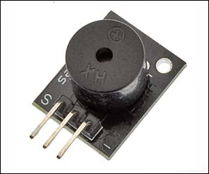

# General

I am talking about a module like this:

This code is to an **active** buzzer.

# Active buzzer

- Have an internal oscilator;
- On connecting to 3.3V or 5V emmits sound;
- You only control turn on or turn off through the microcontroller;
- Have always the same sound.

# Passive buzzer

- Basically a small speaker;
- If you connect to 3.3V, only emmits a short sound (“tic”);
- Needs that the microcontroller generates a frequency (tone()), as example 440Hz or 1000Hz;
- As you generates the frequency, in this case you can emits a music or a more complex sound effect;0

# Connections:

- "-": Arduino GND;
- "S": Arduino port 8;
- Unlabeled: Arduino +3.3V or Arduino +5V

With the code 
